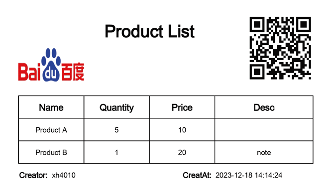

# xlsxTemplater
**xlscTemplater** is a library that generates xlsx documents from an xlsx template by replacing pre-defined {placeholders}. It supports loop conditions, as well as the insertion of images and QRCode. The library is capable of producing output in xlsx/pdf formats.

## Features
- **Basic** {prop}
- **Image** {%image:prop} prop=path/to/file
- **QRcode** {%qrcode:prop} prop is QRcode value
- **Loop** {#itmes}{name}{/items}
- **InnerLoop** {#itmes}{name}{#tags}{tag}{/tags}{/items} '{#tags}{tag}{/tags}' is in the same cell

## Requirements
- It runs on Node.js, Node>=18.
- It utilizes LibreOffice for generating PDFs. Please ensure that [LibreOffice](https://www.libreoffice.org/) is installed beforehand. Alternatively, you can use the provided [dockerfile](docker/dockerfile_libreOffice) to quickly set up a container.

## Installation
```
npm i @xh4010/xlsxtemplater
``` 
## Usage
```javascript
const fs = require('fs').promises;
const XlsxTemplater = require('@xh4010/xlsxtemplater')
async function main() {
  const template = 'path/to/template.xlsx';
  const xlsxTemplater = new XlsxTemplater(template);
  await xlsxTemplater.parse();
  await xlsxTemplater.render({
    logo: 'path/to/logo.png', //absolute path, or by optins image function convert to absolute path
    code: 'https://www.baidu.com',
    creator: 'xh4010',
    creatAt: new Date(),
    items: [{
        name: "Product A",
        quantity: 5,
        price: 10,
        desc:'',
      },
      {
        name: "Product B",
        quantity: 1,
        price:  20,
        desc:'note'
      },
    ],
  })
  const buff = await xlsxTemplater.export();
  const filePath = 'path/to/out.pdf';
  await fs.writeFile(filePath, buff);
}

main().catch(function (err) {
  console.error('Error: ', err);
});
```

## Example
### xlsx template:

### output pdf:


## Acknowledgments
The xlxsTemplater is developed based on the excellent [exceljs](https://github.com/exceljs/exceljs) library.

The pdf export functionality in xlsxTemplater depends on [LibreOffice](https://www.libreoffice.org/), drawing inspiration from the [libreoffice-convert](https://github.com/elwerene/libreoffice-convert) library.

